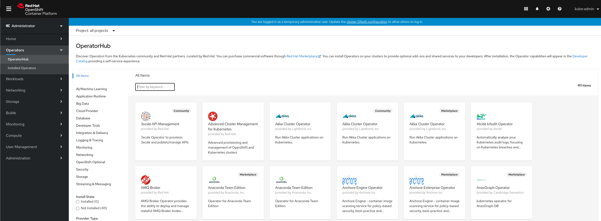

 | [Troubleshooting <](./troubleshooting.md) Postmigration considerations
---
# Postmigration considerations

Now that the migration is completed, there are some considerations to keep in mind once you migrated to OpenShift 4.

* **[Operators](#operators)**
  * [When you might want to move to operators](#when-you-might-want-to-move-to-operators)
  * [Accessing the OperatorHub marketplace](#accessing-the-operatorhub-marketplace)
  * [Creating your own operators](#creating-your-own-operators)
  * [Additional operator resources](#additional-operator-resources)

## Operators

As you might know in OpenShift 4, Operators are a really important piece of the platform. 

An Operator is a method of packaging, deploying and managing a Kubernetes-native application. A Kubernetes-native application is an application that is both deployed on Kubernetes and managed using the Kubernetes APIs and kubectl tooling.

Operators provide:

- Repeatability of installation and upgrade.
- Constant health checks of every system component.
- Over-the-air (OTA) updates for OpenShift components and ISV content.
- A place to encapsulate knowledge from field engineers and spread it to all users, not just one or two.

In OpenShift 4 we have an operator marketplace with different categories depending on their supportability level:

|Category|Description|
|--------|-----------|
|Red Hat Operators|Red Hat products packaged and shipped by Red Hat. Supported by Red Hat.|
|Certified Operators|Products from leading independent software vendors (ISVs). Red Hat partners with ISVs to package and ship. Supported by the ISV.|
|Community Operators|Optionally-visible software maintained by relevant representatives in the [operator-framework/community-operators](https://github.com/operator-framework/community-operators) GitHub repository. No official support.|
|Custom Operators|Operators you add to the cluster yourself. If you have not added any Custom Operators, the Custom category does not appear in the Web console on your OperatorHub.|
|||

**Operators maturity levels**

The level of sophistication of the management logic encapsulated within an Operator can vary. This logic is also in general highly dependent on the type of the service represented by the Operator.

One can however generalize the scale of the maturity of an Operator’s encapsulated operations for certain set of capabilities that most Operators can include. To this end, the following Operator Maturity model defines five phases of maturity for generic day two operations of an Operator:

### **When you might want to move to operators**

If you were using the Service Broker or some OpenShift Templates in OpenShift 3.11 in order to run a specific service such as MongoDB, PostgreSQL, etc. You might want to move to the specific operators for such technologies. 

For example, if your application uses a MongoDB database, it will be very easy to use the MongoDB Operator in order to deploy and manage the MongoDB instance. The operator will take care of the MongoDB instance lifecycle helping you to focus on your application.

### **Accessing the OperatorHub marketplace**

OpenShift 4 console features an operator marketplace called OperatorHub, you will find it under `Operators -> OperatorHub`.

You can use OperatorHub within the OpenShift Console in order to search and install operators. You will be able to manage the installed operators using this same UI.

### **Creating your own operators**

You might have some applications created by internal teams that are currently being deployed manually or using other methods that do not support managing the full lifecycle of the application. On top of that the operations team might need to ensure those applications are up and running.

In such cases, creating an operator to manage the full lifecycle of your application can be very benefitial, you will have the operational knowledge coded inside the operator. That way your operation teams can focus on more interesting tasks since the operational knowledge will be coded inside the operator. 

The [Operator SDK](https://github.com/operator-framework/operator-sdk) is a framework that uses the [controller-runtime](https://github.com/kubernetes-sigs/controller-runtime) library to make writing operators easier by providing:

- High level APIs and abstractions to write the operational logic more intuitively
- Tools for scaffolding and code generation to bootstrap a new project fast
- Extensions to cover common operator use cases

Operator can be written using Go, Ansible or even leveraging existing Helm charts.

You can learn more about how to create your own operators in the [Building Operators on OpenShift](https://learn.openshift.com/operatorframework/) interactive scenarios.

### **Additional operator resources**

You can continue learning about operators in the following resources:

- [OpenShift 4 Operators Documentation](https://docs.openshift.com/container-platform/4.6/operators/understanding/olm-what-operators-are.html)
- [OpenShift 4 Getting started with the Operator SDK](https://docs.openshift.com/container-platform/4.6/operators/operator_sdk/osdk-getting-started.html)
- [Openshift Learn Operators](https://www.openshift.com/learn/topics/operators)
- [Operator SDK Documentation](https://sdk.operatorframework.io/)